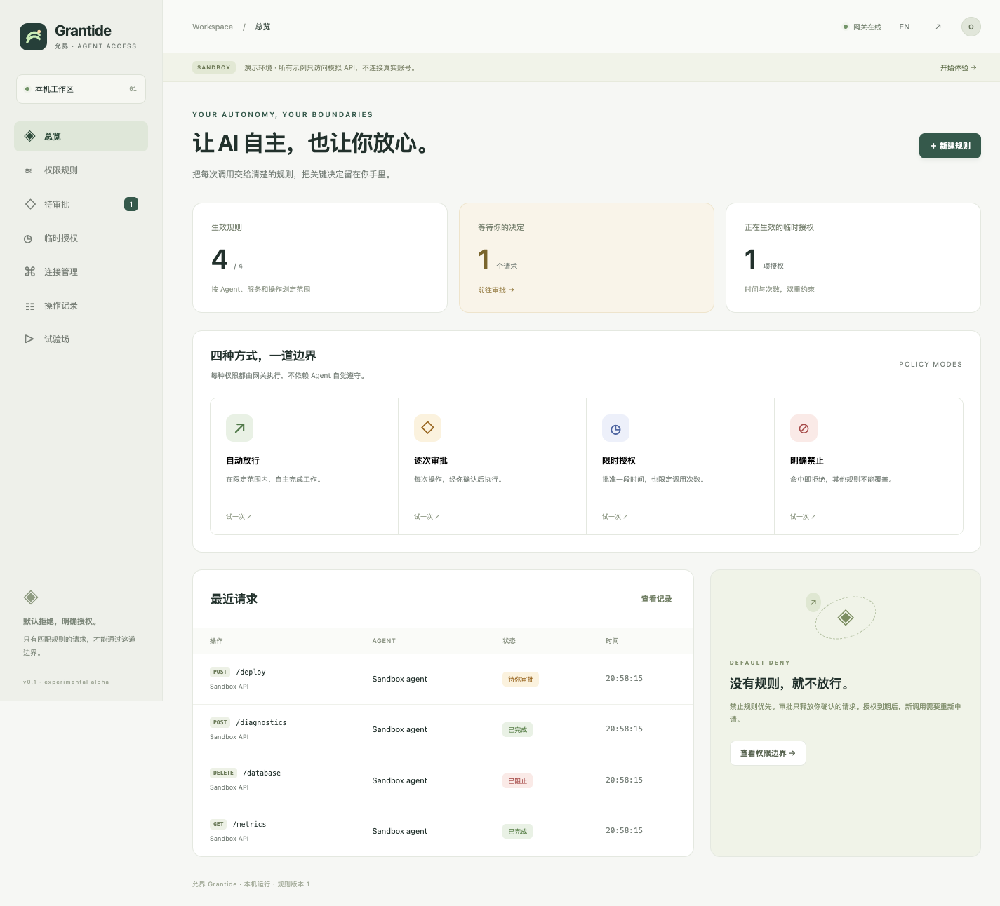
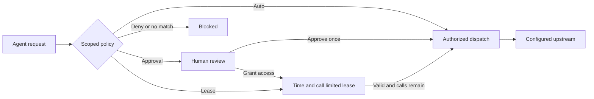

# Grantide · 允界

**Give agents room. Keep control.**

A local permission gateway for AI agents, with a browser console for scoped policies, human approvals and temporary access. One Go binary. No cloud account, JavaScript build step or runtime dependency.

[简体中文](README.zh-CN.md) · [API](docs/API.md) · [Security boundary](SECURITY.md) · [Releases](https://github.com/Sehlani042/grantide/releases)



## Codex login without copying tokens

The included [grantide-login skill](skills/grantide-login/SKILL.md) discovers the local gateway, stores a separate chat identity and requests a website login. Select a saved account and click **Approve and connect**: the paired Chrome extension starts automatically. Optionally allow unlimited revocable use of that exact account/page with no expiry. Results remain available after the client stops waiting.

Automatic filling currently supports CloudCone; CAPTCHA/MFA remains a website step. This does not provide SSH or arbitrary website actions. External API clients can still use the explicit Agent setup below.

| Mode | Behavior |
| --- | --- |
| **Auto allow** | Execute calls within the configured agent, service, method and path scope. |
| **Ask every time** | Hold the exact request until a human reviews its destination, query and JSON body. |
| **Temporary access** | Approve a scoped grant with a deadline and a maximum number of calls. Revoke it at any time. |
| **Always deny** | Reject matching requests even if another rule allows them. |

No matching policy means no access. Agents use their own tokens; only the operator can approve requests or change rules. Credentials are injected by the gateway after authorization.

## Try it locally

Download a binary from [Releases](https://github.com/Sehlani042/grantide/releases), or build with Go 1.25 or later:

```sh
git clone https://github.com/Sehlani042/grantide.git
cd grantide
go build -o bin/grantide ./cmd/grantide
./bin/grantide serve --demo --data-dir .local/demo
```

The server chooses a loopback port and remembers it. Open the console URL printed in the terminal. The private `operator-url` file in the selected data directory contains a one-click login link; alternatively, paste the contents of `operator.token` into the login form. Treat both files as credentials. The console has Chinese and English interfaces.

The demo seeds four example rules and an in-process simulated API. Try reading metrics, deploying, running temporary diagnostics or deleting a database. No real provider account is contacted. The demo uses the same policy, approval and lease engine as real requests; simulated upstream responses are labeled.

## Connect an agent

1. Start without `--demo` using a private data directory outside the agent workspace.
2. In **Connections**, add an agent and save its token (shown once). Add an upstream service origin and optional credential.
3. In **Policies**, define the allowed agent, service, HTTP methods, path prefix and mode. Service IDs are included in the service editor and API snapshot.
4. Give the agent its token and the gateway address. Call through the CLI or HTTP API:

```sh
export GRANTIDE_URL='http://127.0.0.1:YOUR_PORT'
export GRANTIDE_TOKEN='YOUR_AGENT_TOKEN'

./bin/grantide call --service SERVICE_ID --method POST --path /v1/deploy \
  --body '{"environment":"staging","version":"v1.2.0"}'
```

The CLI waits for approval when necessary and prints the result. Use `--query 'key=value'` for query parameters and `--wait 2m` to bound review waiting. Tokens never go into upstream requests; upstream credentials never appear in management snapshots.

## How authorization works



- Explicit deny has highest priority, followed by per-call approval, temporary access, then automatic access. Same-mode ties select the narrower agent/path/method scope, then stable rule ID. `/v1` matches `/v1` and `/v1/...`, not `/v10`.
- An expired matching policy denies instead of falling through to a weaker rule. This supports temporary pre-authorized access as well as approval-created leases.
- A lease belongs to one agent and one rule revision. Its call limit includes the initial approved request. Consumption is serialized, including concurrent calls. Failed upstream attempts consume a call; there are no automatic retries.
- Changing any agent, service or policy invalidates pending requests and existing grants. Restart also drops pending requests and grants. Configuration and the last 500 metadata audit events persist encrypted.
- Pending approvals expire after five minutes (or sooner if the rule expires). Approval expiry and grant expiry are separate clocks.
- Revocation prevents future dispatches. A request already dispatched cannot be undone.

## Scope of this alpha

Grantide v0.3 is an **explicit JSON HTTP gateway**, not a transparent proxy or an OS sandbox. Agents must call its API/CLI. An agent with direct network access and its own provider credentials can bypass it. An agent running as the operator's OS user may read or modify the gateway's files. Use an isolated agent account/container with network controls when enforcement against an untrusted agent is required; this alpha does not install those controls for you.

Policies match agent, service, method and path, not fields inside the body or query. For example, a GraphQL endpoint may contain both reads and writes at one path; use per-call approval until you have a narrower trusted adapter. Upstream responses are capped at 64 KiB. Bodies must be JSON; streaming, WebSocket, SSH, shell execution, MCP transport and hosted multi-user operation are not implemented.

The local state is AES-256-GCM encrypted, with key and token files restricted by filesystem permissions. Keeping the key next to state protects neither from an attacker who can read the whole directory. No independent security audit is claimed. Read [SECURITY.md](SECURITY.md) before connecting real credentials.

## Development

```sh
go test -race ./...
go vet ./...
node --check internal/webui/assets/app.js
go run ./cmd/grantide serve --demo --data-dir .local/demo
```

The browser assets are embedded into the binary. Restart after changing them. No third-party Go modules or frontend packages are required. CI tests Linux, macOS and Windows. `scripts/build-release.sh` builds archives for macOS/Linux arm64 and amd64, plus Windows amd64.

See [PRD](PRD.md), [design](DESIGN.md), [test plan](TEST.md) and [release notes](RELEASE.md). This is an independently developed MIT-licensed project.

## Human credential entry

Agents can use `grantide credential` to request a credential through the GUI. Operators enter an API key or HTTP Basic username/password locally; agents receive only request status. Saving does not approve execution. See [Codex setup and workflow](docs/CODEX.md). For website sign-in use the separate browser handoff below; SSH and sudo are not supported.

## Browser login handoff

For website login, agents can use `grantide browser-login` to pause for human password/QR/MFA entry on the original browser tab. The GUI tracks the owning conversation and distinguishes human completion from agent verification. This cooperative protocol does not lock independent browser tools or approve purchases. [Integration and boundaries](docs/BROWSER-HANDOFF.md).

## Automatic website login (v0.4 development)

Save a website account in the local GUI, issue a scoped grant, and invoke `grantide web-login --grant REF`. An optional controlled Chromium worker fills credentials and handles the ordinary login flow; CAPTCHA/MFA uses an operator handoff. CloudCone login was verified with external AI assistance for one CAPTCHA; live inventory extraction and the later transport revision still need real-account validation. This does not export a browser session to general agent tools. See [setup, CLI and security boundaries](docs/CONTROLLED-LOGIN.md).

For reuse in another Codex chat, use **$grantide-login** or read the [skill](skills/grantide-login/SKILL.md). Link this checkout's `skills/grantide-login` directory into your local skills directory; the symlink keeps references and the executable helper together. The skill handles current-chat connection lookup, grant selection, extension filling, challenge handling, Chrome recovery and target-page verification. [Connection setup](skills/grantide-login/references/chat-connection.md) binds each chat to its own configured Agent; no token or grant is borrowed. Existing chats whose catalogs predate installation can read the file explicitly. Automatic website filling currently supports CloudCone only. [Development lessons and evidence](docs/LOGIN-LESSONS.md).

Expiry and usage count are independent: explicitly choose no expiry and/or unlimited uses, with revocation at any time. Account starts are at least 60 seconds apart; each run is capped at ten minutes. Failed/interrupted runs pause the account until operator review. Existing exhausted grants are not upgraded automatically.

## Chrome extension (development)

Use `grantide web-login --grant REF --extension` to fill a saved CloudCone account in an existing Chrome tab through a paired Native Messaging host. The unpacked Manifest V3 source, macOS/Linux installation and boundaries are in [Chrome extension setup](docs/CHROME-EXTENSION.md). Existing-session account matching and real extension login are not yet validated. Chrome sessions remain in Chrome; they are separate from Codex’s in-app browser.

## Console password and remembered login

Configure an administrator password locally with `grantide operator-password --data-dir /absolute/private/state`, supplying the password through stdin while the service is stopped. It is stored only as a salted hash; no default password is shipped. Keep the password out of command arguments, shell history and Git. The native bridge/API operator token remains available for existing integrations.

The GUI accepts the configured password. Select **Remember me · 30 days** to retain the browser session across reopened pages and server restarts. Signing out revokes that session. Other browser profiles must sign in separately. Existing Agent tokens, saved website accounts and login grants are retained. Sessions use a host-only HttpOnly/SameSite cookie on the existing loopback HTTP service; cookies are not port-isolated and same-OS-user processes remain outside the product boundary.
